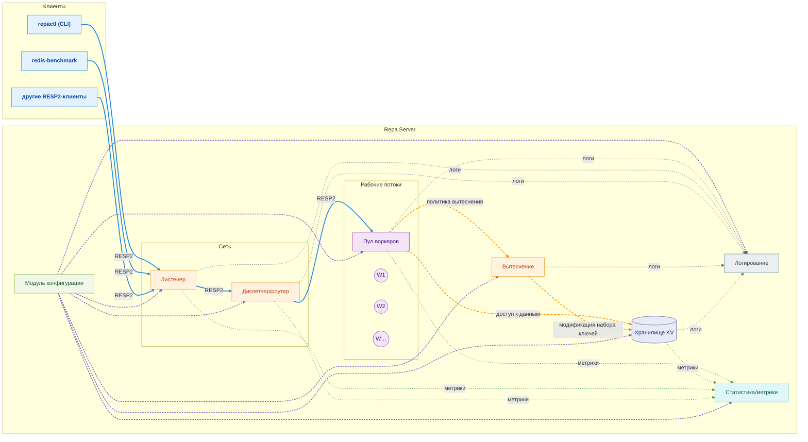
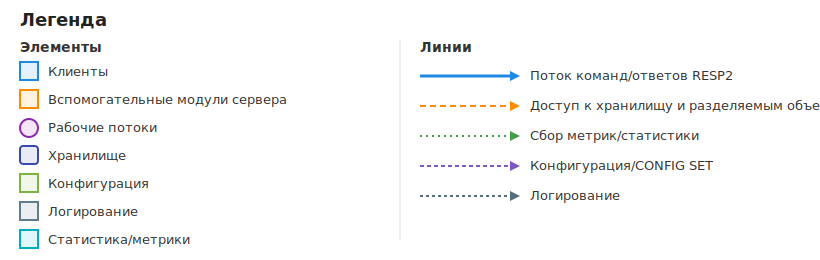

# Repa

In-memory key-value хранилище на потоках (аналог Redis).

## Краткое описание

Реализуйте сервер **Repa** — in-memory key-value хранилище с протоколом RESP2 и
параллельной обработкой клиентских запросов на POSIX-потоках.

## Схема

Примерная схема финального решения без деталей внутренней реализации.





## Функциональные требования

### Протокол и команды

Repa должна поддерживать следующее подмножество команд протокола **RESP2**:

1. `HELLO 2`
1. `AUTH <username> <password>`
1. `QUIT`
1. `PING`
1. `GET`, `SET`, `DEL`
1. `CONFIG GET`, `CONFIG SET` (в связке `GET/SET`, см. документацию)
1. `EXPIRE`, `TTL`
1. `STATS` — дополнительная команда, см. п. [статистика](#логирование-и-статистика).

Семантика поддерживаемых команд должна соответствовать Redis для
выбранного подмножества, чтобы можно было использовать стандартные инструменты,
например, `redis-benchmark`. Регистр команд неважен (принимаются get, GET и т. п.).

### Параллельная обработка

1. Запросы разных клиентов обрабатываются **параллельно**:
    в демонстрации должно быть видно, что несколько сессий
    работают одновременно и не блокируют друг друга.
1. Число клиентских сессий **не ограничено** (кроме системных
    лимитов, например, по открытым файловым дескрипторам).

## Архитектура, потоковая модель и масштабирование

1. Используйте **POSIX threads**.
1. Обеспечьте корректную **синхронизацию доступа** к общим данным.
1. Все потоки корректно завершаются, **ресурсы освобождаются**
    (`join`, cleanup-handlers).
1. Прерывания потоков — корректное использование `pthread_cancel`,
    точек отмены и обработчиков очистки.
1. **Фоновые задачи** (например, garbage collector, управление
    памятью/вытеснение) выполняются в **отдельных потоках** и
    **не мешают** обработке клиентских запросов.
1. Стратегия масштабирования **не зафиксирована**. Выберите архитектуру
    самостоятельно.

## Производительность

1. **Запрещены** холостые циклы и искусственные задержки
    (`sleep`, `usleep` и т. п.). Разрешены примитивы `pthread`,
    мультиплексирование и AIO.
1. Поддержка [**RESP2 pipelining**](https://redis.io/docs/latest/develop/using-commands/pipelining/)
    обязательна и обрабатывается строго в порядке поступления команда.
    Клиент может отправлять несколько команд подряд без ожидания ответов сразу.
1. Сервер должен уметь обрабатывать частичные чтения/записи и
    корректно фреймить поток RESP2 (т.е. не ломаться на границах пакетов).
1. Нагрузка на CPU в простое должна быть **минимальной**,
    особенно при отсутствии подключений.
1. Требуется **динамическое расширение хранилища**. Нельзя при старте
    сразу создавать хранилище максимального размера. Оно должно
    расти по мере роста клиентских запросов.

### Обработка сигналов и корректное завершение

Необходимо наличие **graceful shutdown**:

1. При `SIGINT`/`SIGTERM`/`SIGQUIT` сервер закрывает
    вход новых соединений,  завершает активные запросы, даёт потокам до 5с
    на завершение, затем отменяет их (`pthread_cancel`) и освобождает ресурсы.
1. В логах должны быть понятные отметки этапов, например:
  `Received shutdown signal` -> `All threads have finished` -> `Repa finished`.

## Управление данными и памятью

1. Кэш хранится **в памяти** и может полностью теряться при перезапуске
    (персистентность — **необязательна, но будет плюсом**).
1. При достижении лимита памяти хранилище должно
    **продолжать работать** за счёт:
    1. динамического выделения дополнительного сегмента
        (пока суммарный объём не превысит лимит), **или**
    1. удаления "ненужных" записей по алгоритму вытеснения
        (**LRU**, **SLRU**, **LFU**, **Clock** и т. п.).
1. Аллокация/Сборка мусора/вытеснение выполняются **в отдельном потоке**.

## Аутентификация

1. Сервер поддерживает команду `AUTH <username> <password>` (RESP2).
  До успешной аутентификации разрешены только `HELLO`, `AUTH`, `PING`, `QUIT`
  (остальные команды должны отвечать ошибкой "Not authorized").
1. Должен существовать **дефолтный пользователь** для дебага, чтобы можно было
    проверить базовую работоспособность без дополнительной настройки.
    > Рекомендуемые значения по умолчанию: `username=admin`, `password=admin`.
1. Клиентская утилита `repactl` при подключении запрашивает **имя пользователя**
    и **пароль**; ввод пароля **маскируется**.

## Логирование и статистика

1. Должен быть **модуль логирования** с уровнями.
    Рекомендуется переиспользовать модуль из 1-го семестра.
1. Сообщения должны быть определены по уровням: `DEBUG`, `INFO`, `WARNING`, `ERROR`.
    По умолчанию: `INFO`, с `--verbose` уровень становится `DEBUG`.
1. Команда `STATS` возвращает накопленную сервером статистику. Пример:

```
STATS
1. Requests
  total_commands_processed      2,777
  cmd_get                       1,523
  cmd_set                         804
  cmd_del                          77

2. Cache
  cache_hits                    2,310
  cache_misses                     94
  hit_ratio                     96.1%

3. Memory
  used_memory_bytes        10,485,760  (25.0 / 256.0 MiB, 10%)

4. Connections / Uptime
  current_connections              1500
  total_connections_received       5609
  uptime_s                      8,645  (2h 24m 5s)
```

## Конфигурация

1. Должен быть **модуль конфигурации** для управления Repa.
    Рекомендуется переиспользовать модуль из 1-го семестра.

Где искать конфиг:

1. По умолчанию: `repa.conf` в текущей директории.
1. Путь можно указать флагом: `--config <path>`.

Приоритет источников по убыванию:
`CONFIG SET` -> CLI-флаги -> config-файл -> значения по умолчанию.

Пример `repa.conf`:

```conf
port = 6380

default_user = admin
default_password = admin

max_memory_mb = 256
default_ttl = 0

workers = 4

log_level = info
log_output = repa.log
```

Можно добавлять свои параметры конфигурации.

## CLI интерфейс сервера (repa)

Поддерживаемые флаги:

1. `--port <num>` — порт, на котором слушает Repa;
1. `--config <path>` — путь до файла конфигурации Repa;
1. `--verbose` — включить подробное логирование;
1. `--max-memory-mb <num>` — максимальный объём памяти для хранения в мегабайтах;
1. `--workers <num>` — кол-во воркеров;
1. `--default-ttl <sec>` — TTL записей по умолчанию; `0` — бессрочно;
1. `--help` — подсказка по запуску и флагам.

## Клиентская утилита (repactl)

Поддерживаемые флаги:

1. `--port <num>` — порт, на котором слушает Repa;
1. `--addr <address>` — адрес, на котором запущена Repa;
1. `--user <name>` — имя пользователя для подключения к Repa;

Необходимо:

1. Интерактивная работа:
    1. поддержка **истории команд** через перелистывание стрелками;
    1. передвижение позиции курсора по строке.
1. **Аутентификация**:
    1. если `--user` не указан, утилита запросит имя пользователя;
    1. пароль запрашивается всегда, и его ввод **маскируется**.
1. Утилита отправляет команды в формате RESP2 и отображает ответы сервера.

## Диаграммы и демонстрация

**Обязательный артефакт**: текстовое описание архитектуры решения со схемами
потоков и модулей.

Также опишите:
1. Как решаете: **балансировку** работы между потоками, **синхронизацию** по общим
    структурам данных, **вытеснение** записей;
1. Как обеспечивается **graceful shutdown**;
1. Как обеспечиваете **низкое потребление CPU** в простое;
1. Какую **статистику** собираете;
1. Какие метрики/тесты используете для **подтверждения работоспособности** и
    **производительности** решения.

Подготовьте **сценарий демонстрации параллельности**: несколько одновременных
сессий без взаимных блокировок.
